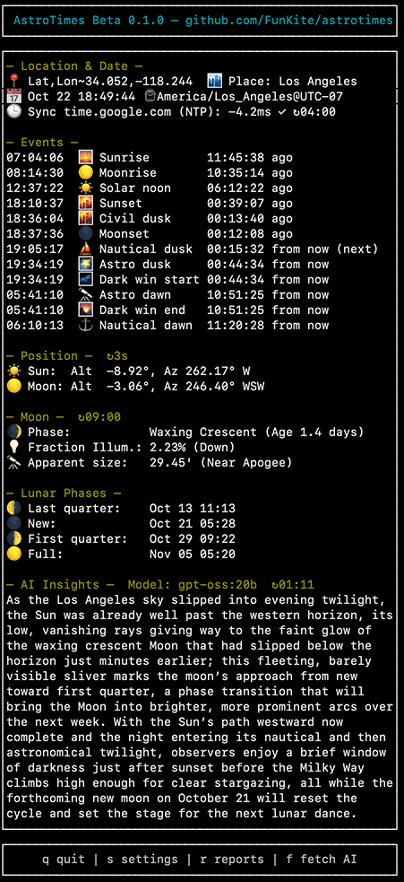

# Astrotimes (Rust)

A blazing-fast astronomical calculation library and CLI that provides sun and moon information for any location and date. Built in Rust for maximum performance and reliability.

**Dual Purpose:**
- **📚 Library**: Use in your Rust projects via a clean, well-documented API
- **💻 CLI**: Standalone command-line tool with interactive TUI and JSON output

⚠️ **Notice:** Though efforts have been made to ensure reliability, the software may contain defects or inaccuracies. It is intended for educational and entertainment use only.

## Features

### Core Astronomical Data
- **Sun**: Sunrise, Solar Noon, Sunset
- **Twilight**: Civil, Nautical, and Astronomical dawn and dusk times
- **Real-time Position**: Current solar and lunar altitude and azimuth
- **Moon Events**: Moonrise, Moonset, and Transit times
- **Moon Details**:
  - Phase name, emoji, angle, and illumination percentage
  - Monthly calendar of lunar phases (New, First Quarter, Full, Last Quarter)
  - Distance from Earth and apparent angular size
  - Maximum altitude for the day

### Key Features

- **High-Precision Calculations**: Uses NOAA solar algorithms and Meeus lunar algorithms for accuracy within 1-3 minutes.
- **Offline-First Core**: All core astronomical calculations run locally.
- **AI-Powered Insights**: Connects to Ollama for narrative summaries of astronomical events (optional).
- **Time Sync Verification**: Checks system clock accuracy against internet time servers (optional).
- **Interactive Watch Mode**: A live-updating TUI that refreshes automatically.
- **City Database**: Built-in database of 570+ cities worldwide.
- **JSON & HTML Output**: Provides machine-readable JSON output and generates shareable HTML calendars.
- **Configuration**: Remembers your last location for quick subsequent runs.

## Screenshot

AstroTimes in watch mode showing live astronomical data for Los Angeles:



In watch mode (the default), this display updates in real-time every second, giving you a live view of the sky. Press `s` to open the settings menu, `r` for reports, or `q` to quit.

## Installation

### From Source

```bash
# Clone the repository
git clone https://github.com/funkite/astrotimes.git
cd astrotimes

# Build release version
cargo build --release

# Install to system
cargo install --path .
```

### Run Directly

```bash
cargo run --release -- --help
```

### As a Library

Add to your `Cargo.toml`:

```toml
[dependencies]
astrotimes = { git = "https://github.com/FunKite/astrotimes" }
chrono = "0.4"
chrono-tz = "0.9"
```

Quick example:

```rust
use astrotimes::prelude::*;
use chrono::Local;
use chrono_tz::America::New_York;

fn main() {
    // Create a location (latitude, longitude)
    let location = Location::new(40.7128, -74.0060).unwrap();
    let now = Local::now().with_timezone(&New_York);

    // Calculate sunrise and sunset
    if let Some(sunrise) = calculate_sunrise(&location, &now) {
        println!("Sunrise: {}", sunrise.format("%H:%M:%S"));
    }

    if let Some(sunset) = calculate_sunset(&location, &now) {
        println!("Sunset: {}", sunset.format("%H:%M:%S"));
    }

    // Get current moon phase
    let (phase_name, phase_emoji) = get_current_moon_phase(&location, &now);
    println!("Moon phase: {} {}", phase_emoji, phase_name);
}
```

See the [examples directory](./examples/) for more usage patterns including:
- City database searching
- Lunar phase calculations
- Batch processing multiple dates
- Custom twilight calculations

## CLI Usage

### Basic Usage

```bash
# Use a city from the database
astrotimes --city "New York"

# Specify location with coordinates
astrotimes --lat 40.7128 --lon=-74.0060 --tz=America/New_York

# Show help
astrotimes --help
```

### Interactive Watch Mode

The default mode is a live-updating display:

| Key | Action |
|-----|--------|
| `q` | Quit the application |
| `s` | Open Settings menu |
| `r` | Open Reports menu (calendar, USNO validation, benchmark) |
| `f` | Manually refresh AI insights (if enabled) |

**Settings Menu (`s` key):**
- Location mode (City / Manual / Auto IP detection)
- Time sync settings (enable/disable, NTP server)
- Display sections (Location/Date, Events, Positions, Moon, Lunar Phases)
- Night mode (red text to preserve night vision)
- AI insights configuration (enable/disable, server, model, refresh interval)

**Reports Menu (`r` key):**
- Calendar generator (HTML/JSON export for date ranges)
- USNO validation (compare accuracy against U.S. Naval Observatory data)
- Performance benchmark (test calculation speed across all cities)

Watch mode updates the clock every second, refreshes sun/moon positions every 10 seconds, refreshes the detailed moon data hourly, and rebuilds the lunar phase list each night at local midnight to keep CPU usage minimal while keeping the numbers accurate.

### JSON Output

```bash
astrotimes --city "Tokyo" --json
```

### Calendar Generation

Produce full-range astronomical calendars with daily sunrise, sunset, twilight, moonrise, moonset, and phase data.

```bash
# Generate an HTML calendar for January 2026
astrotimes --city "Lisbon" \
  --calendar \
  --calendar-start 2026-01-01 \
  --calendar-end 2026-01-31 \
  --calendar-format html \
  --calendar-output lisbon-jan-2026.html

# JSON calendar spanning the Apollo 11 mission window
astrotimes --lat 28.5721 --lon -80.6480 \
  --calendar \
  --calendar-start 1969-07-15 \
  --calendar-end 1969-07-27 \
  --calendar-format json
```

Calendars can cover any range between astronomical years `-0999` (1000 BCE) and `3000`. BCE dates use the proleptic Gregorian format with a leading minus (e.g. `-0032-11-01`).

In watch mode, press `r` to open the Reports menu, then select the calendar generator to interactively adjust the range, toggle HTML/JSON, and export directly from the TUI.

## Advanced Features

### AI-Powered Insights (Optional)

AstroTimes can connect to a local [Ollama](https://ollama.com/) instance to provide narrative, AI-generated insights based on the current astronomical data. This feature can summarize the sky view, highlight interesting events, and offer context beyond the raw numbers.

**To use this feature:**
1. Ensure you have Ollama installed and running.
2. Pull a model (e.g., `ollama pull llama3:8b`).
3. Run AstroTimes with the `--ai-insights` flag.

```bash
# Enable AI insights with a default model
astrotimes --ai-insights

# Specify a custom model and server
astrotimes --ai-insights --ai-model "llama3:8b" --ai-server "http://192.168.1.100:11434"
```
In watch mode, press `s` to open the Settings menu where you can configure AI insights, including enabling/disabling them, selecting models, and setting the refresh interval.

### Location Services

- **City Database**: Built-in database of 570+ cities worldwide with coordinates and timezone data
- **Manual Coordinates**: Specify exact latitude, longitude, elevation, and timezone for any location
- **Time Synchronization**: Checks system clock accuracy against NTP servers to ensure reliable event timing

### Calculation Standard

All astronomical calculations follow U.S. Naval Observatory (USNO) conventions for standardized, reproducible results that align with celestial navigation standards used in maritime and aviation almanacs.

### Command-Line Options

| Flag | Description |
|------|-------------|
| `--lat <LAT>` | Latitude in decimal degrees |
| `--lon <LON>` | Longitude in decimal degrees |
| `--tz <TZ>` | Timezone (IANA format, e.g., America/New_York) |
| `--city <CITY>` | Select city from database |
| `--date <DATE>` | Date in YYYY-MM-DD format (default: today) |
| `--json` | Output in JSON format |
| `--calendar` | Generate a calendar instead of standard output |
| `--calendar-format <html\|json>` | Calendar output format (`html` or `json`, default: `html`) |
| `--calendar-start <DATE>` | Calendar start date (requires `--calendar`) |
| `--calendar-end <DATE>` | Calendar end date (requires `--calendar`) |
| `--calendar-output <PATH>` | Optional file path for the calendar |
| `--ai-insights` | Enable AI-powered insights (requires Ollama) |
| `--ai-server <URL>` | Ollama server address (e.g., `http://localhost:11434`) |
| `--ai-model <MODEL>` | Ollama model to use for insights (e.g., `llama3:8b`) |
| `--ai-refresh-minutes <MIN>` | Refresh interval for AI insights in minutes (1-60) |
| `--no-prompt` | Disable interactive prompts |
| `--no-save` | Don't save configuration |

## Technical Details

### Calculation Methods

- **Solar Calculations**: NOAA solar calculation algorithms - accuracy within 1-3 minutes for mid-latitudes
- **Lunar Position**: High-precision topocentric model accounting for Earth's flattening and parallax
- **Lunar Phases**: Meeus "Phases of the Moon" algorithm from "Astronomical Algorithms" - minute-level accuracy
- **Rise/Set Times**: Bisection root-finding with standard atmospheric refraction corrections

### Accuracy

When compared against U.S. Naval Observatory reference data:
- Solar events (sunrise/sunset/twilight): ±1-3 minutes
- Lunar events (moonrise/moonset): ±3 minutes at mid-latitudes
- Lunar phase times: ±2 minutes

### Data Storage

Configuration is saved to `~/.astro_times.json`:

```json
{
  "lat": 40.7128,
  "lon": -74.0060,
  "tz": "America/New_York",
  "city": "New York"
}
```

## Architecture

The project is organized into focused modules:

- `astro/` - Core astronomical calculations
  - `sun.rs` - Solar position and event calculations (NOAA algorithms)
  - `moon.rs` - Lunar position, phases, and events (Meeus algorithms)
  - `coordinates.rs` - Coordinate transformations and compass bearings
  - `time_utils.rs` - Time formatting and duration calculations
- `tui/` - Terminal user interface
  - `app.rs` - Application state management
  - `ui.rs` - Rendering and display logic
  - `events.rs` - Keyboard input handling
- `cli.rs` - Command-line argument parsing
- `city.rs` - City database and search functionality
- `config.rs` - Configuration persistence
- `output.rs` - JSON output formatting
- `main.rs` - Application entry point and orchestration

## Dependencies

All dependencies are well-maintained Rust crates:

- `clap` - Command-line argument parsing
- `ratatui` + `crossterm` - Terminal UI
- `chrono` + `chrono-tz` - Date/time handling
- `serde` + `serde_json` - Serialization
- `reqwest` - HTTP client (for optional location detection)
- `fuzzy-matcher` - City search
- `anyhow` + `thiserror` - Error handling

## Why Rust? The Benefits

This application is built in Rust to leverage its unique strengths for creating high-performance, reliable command-line tools:

- **Performance**: Rust is compiled to a native binary that runs directly on the CPU, offering C-like speed without the need for a runtime or garbage collector. This ensures a fast startup (~100ms) and low memory usage (~15 MB).
- **Reliability**: Rust's strict compiler and ownership model eliminate entire classes of common bugs (e.g., null pointer dereferences, data races) at compile time. This is critical for a scientific application where calculation integrity is paramount.
- **Single Binary**: The entire application, including the elevation map and city database, is compiled into a single, statically-linked executable. This makes installation and distribution trivial—just copy the file and run it.
- **Cross-Platform**: Rust provides excellent cross-platform support, allowing AstroTimes to run natively on Windows, macOS, and Linux from the same codebase.
- **Modern Tooling**: The project benefits from Rust's modern ecosystem, including its built-in package manager (`cargo`), testing framework, and high-quality, community-vetted libraries (crates).

## License

MIT

## Bug Reports and Feature Requests

Bug reports and feature requests are welcome and appreciated. Please open a GitHub Issue to describe any problems, ideas, or enhancement suggestions.

At this time, development and maintenance are handled by the repository owner. While external pull requests are not being accepted, user feedback is invaluable in helping guide priorities, improve stability, and shape future releases.

---

🌅 Built with Rust for accuracy, speed, and reliability
