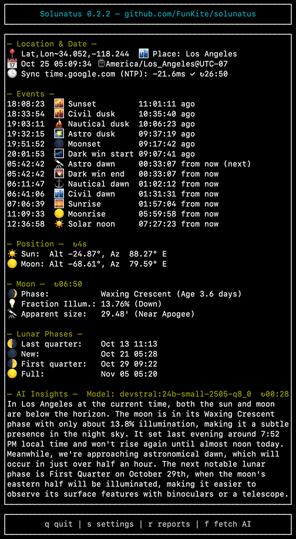

# Solunatus

[](https://crates.io/crates/solunatus)
[](https://crates.io/crates/solunatus)
[](https://github.com/FunKite/solunatus/blob/main/LICENSE)
[](https://www.rust-lang.org)
[](https://docs.rs/solunatus)

A high-precision astronomical calculation library and CLI tool that provides comprehensive sun and moon information for any location and date.

## What is Solunatus?

Solunatus computes astronomical events and positions using industry-standard algorithms (NOAA for solar calculations, Meeus for lunar). Whether you're planning photography sessions, scheduling outdoor activities, or building astronomy-related applications, Solunatus delivers accurate, offline-first calculations for sunrise/sunset, moon phases, twilight periods, and celestial positions.

**Dual Purpose:**
- **📚 Library**: Clean, well-documented Rust API for integrating astronomical calculations into your projects
- **💻 CLI**: Feature-rich command-line tool with interactive TUI, JSON output, and calendar generation

**Key Highlights:**
- ✅ Offline-first core (no internet required for calculations)
- ✅ 570+ cities worldwide in built-in database
- ✅ Historical and future dates (1000 BCE to 3000 CE)
- ✅ USNO-compliant calculations for navigation-grade accuracy
- ✅ Optional AI-powered insights via local Ollama integration

⚠️ **Notice:** Though efforts have been made to ensure reliability, the software may contain defects or inaccuracies. It is intended for educational and entertainment use only.

## Quick Start

Get up and running in under a minute:

```bash
# Install from crates.io
cargo install solunatus

# Run with a city name
solunatus --city "New York"

# Or use coordinates
solunatus --lat 40.7128 --lon -74.0060 --tz America/New_York
```

The interactive TUI will display live astronomical data. Press `q` to quit, `s` for settings, or `r` for reports/calendar generation.

For detailed installation instructions, see the [Installation Guide](docs/installation/README.md) or the [Quick Start Guide](docs/installation/quick-start.md).

## Table of Contents

- [What is Solunatus?](#what-is-solunatus)
- [Quick Start](#quick-start)
- [Features](#features)
- [Screenshot](#screenshot)
- [Installation](#installation)
  - [From crates.io](#from-cratesio-recommended)
  - [From Source](#from-source)
  - [As a Library](#as-a-library)
- [CLI Usage](#cli-usage)
  - [Basic Usage](#basic-usage)
  - [Interactive Watch Mode](#interactive-watch-mode)
  - [JSON Output](#json-output)
  - [Calendar Generation](#calendar-generation)
- [Advanced Features](#advanced-features)
  - [AI-Powered Insights](#ai-powered-insights-optional)
  - [Location Services](#location-services)
  - [Calculation Standard](#calculation-standard)
  - [Command-Line Options](#command-line-options)
- [Technical Details](#technical-details)
- [Architecture](#architecture)
- [Performance](#performance)
- [Documentation](#documentation)
- [Contributing](#contributing)
- [License](#license)

## Features

### Core Astronomical Data
- **Sun**: Sunrise, Solar Noon, Sunset
- **Twilight**: Civil, Nautical, and Astronomical dawn and dusk times
- **Real-time Position**: Current solar and lunar altitude and azimuth
- **Moon Events**: Moonrise, Moonset, and Transit times
- **Moon Details**:
  - Phase name, emoji, angle, and illumination percentage
  - Monthly calendar of lunar phases (New, First Quarter, Full, Last Quarter)
  - Distance from Earth and apparent angular size
  - Maximum altitude for the day

### Key Features

- **Offline-First Core**: All core astronomical calculations run locally.
- **AI-Powered Insights**: Connects to Ollama for narrative summaries of astronomical events (optional).
- **Time Sync Verification**: Checks system clock accuracy against internet time servers (optional).
- **Interactive Watch Mode**: A live-updating TUI that refreshes automatically.
- **City Database**: Built-in database of 570+ cities worldwide.
- **JSON & HTML Output**: Provides machine-readable JSON output and generates shareable HTML calendars.
- **Configuration**: Remembers your last location for quick subsequent runs.

## Screenshot

Solunatus in watch mode showing live astronomical data for Los Angeles:



In watch mode (the default), this display updates in real-time every second, giving you a live view of the sky. Press `s` to open the settings menu, `r` for reports, or `q` to quit.

## Installation

**Requirements:**
- Rust 1.70 or later
- Cargo (included with Rust)

### From crates.io (Recommended)

```bash
cargo install solunatus
```

### From Source

```bash
# Clone the repository
git clone https://github.com/FunKite/solunatus.git
cd solunatus

# Build release version
cargo build --release

# Install to system
cargo install --path .
```

### As a Library

Solunatus can be used as a library in your Rust projects for high-precision astronomical calculations.

**Add to your `Cargo.toml`:**

```toml
[dependencies]
solunatus = "0.2"
chrono = "0.4"
chrono-tz = "0.10"
```

**Quick example:**

```rust
use solunatus::prelude::*;
use chrono::Local;
use chrono_tz::America::New_York;

fn main() {
    // Create a location (latitude, longitude)
    let location = Location::new(40.7128, -74.0060).unwrap();
    let now = Local::now().with_timezone(&New_York);

    // Calculate sunrise and sunset
    if let Some(sunrise) = calculate_sunrise(&location, &now) {
        println!("Sunrise: {}", sunrise.format("%H:%M:%S"));
    }

    if let Some(sunset) = calculate_sunset(&location, &now) {
        println!("Sunset: {}", sunset.format("%H:%M:%S"));
    }

    // Get current sun position
    let (altitude, azimuth) = calculate_sun_position(&location, &now);
    println!("Sun: {:.2}° altitude, {:.2}° azimuth", altitude, azimuth);

    // Get current moon phase
    let (phase_name, phase_emoji) = get_current_moon_phase(&location, &now);
    println!("Moon phase: {} {}", phase_emoji, phase_name);
}
```

**More Examples:**

The [examples directory](./examples/) contains comprehensive usage patterns:
- **[basic_usage.rs](examples/basic_usage.rs)** - Getting started with sun/moon calculations
- **[city_search.rs](examples/city_search.rs)** - Using the built-in city database
- **[moon_phases.rs](examples/moon_phases.rs)** - Calculate monthly lunar phases
- **[batch_processing.rs](examples/batch_processing.rs)** - Efficient multi-day calculations
- **[custom_events.rs](examples/custom_events.rs)** - Advanced twilight and solar events

Run any example with:
```bash
cargo run --example basic_usage
```

**API Documentation:**

Full API documentation is available at [docs.rs/solunatus](https://docs.rs/solunatus)

## CLI Usage

### Basic Usage

```bash
# Use a city from the database
solunatus --city "New York"

# Specify location with coordinates
solunatus --lat 40.7128 --lon=-74.0060 --tz=America/New_York

# Show help
solunatus --help
```

### Interactive Watch Mode

The default mode is a live-updating display:

| Key | Action |
|-----|--------|
| `q` | Quit the application |
| `s` | Open Settings menu |
| `r` | Open Reports menu (calendar, USNO validation, benchmark) |
| `f` | Manually refresh AI insights (if enabled) |

**Settings Menu (`s` key):**
- Location mode (City / Manual)
- Time sync settings (enable/disable, NTP server)
- Display sections (Location/Date, Events, Positions, Moon, Lunar Phases)
- Night mode (red text to preserve night vision)
- AI insights configuration (enable/disable, server, model, refresh interval)

**Reports Menu (`r` key):**
- Calendar generator (HTML/JSON export for date ranges)
- USNO validation (compare accuracy against U.S. Naval Observatory data)
- Performance benchmark (test calculation speed across all cities)

Watch mode continuously updates the clock and refreshes sun/moon positions every 5 seconds, detailed moon data every 10 minutes, and rebuilds the lunar phase list at local midnight to balance accuracy with CPU efficiency.

### JSON Output

```bash
solunatus --city "Tokyo" --json
```

### Calendar Generation

Produce full-range astronomical calendars with daily sunrise, sunset, twilight, moonrise, moonset, and phase data.

```bash
# Generate an HTML calendar for January 2026
solunatus --city "Lisbon" \
  --calendar \
  --calendar-start 2026-01-01 \
  --calendar-end 2026-01-31 \
  --calendar-format html \
  --calendar-output lisbon-jan-2026.html

# JSON calendar spanning the Apollo 11 mission window
solunatus --lat 28.5721 --lon -80.6480 \
  --calendar \
  --calendar-start 1969-07-15 \
  --calendar-end 1969-07-27 \
  --calendar-format json
```

Calendars can cover any range between astronomical years `-0999` (1000 BCE) and `3000`. BCE dates use the proleptic Gregorian format with a leading minus (e.g. `-0032-11-01`).

In watch mode, press `r` to open the Reports menu, then select the calendar generator to interactively adjust the range, toggle HTML/JSON, and export directly from the TUI.

## Advanced Features

### AI-Powered Insights (Optional)

Solunatus can connect to a local [Ollama](https://ollama.com/) instance to provide narrative, AI-generated insights based on the current astronomical data. This feature can summarize the sky view, highlight interesting events, and offer context beyond the raw numbers.

**To use this feature:**
1. Ensure you have Ollama installed and running.
2. Pull a model (e.g., `ollama pull llama3:8b`).
3. Run Solunatus with the `--ai-insights` flag.

```bash
# Enable AI insights with a default model
solunatus --ai-insights

# Specify a custom model and server
solunatus --ai-insights --ai-model "llama3:8b" --ai-server "http://192.168.1.100:11434"
```
In watch mode, press `s` to open the Settings menu where you can configure AI insights, including enabling/disabling them, selecting models, and setting the refresh interval.

### Location Services

- **City Database**: Built-in database of 570+ cities worldwide with coordinates and timezone data
- **Manual Coordinates**: Specify exact latitude, longitude, elevation, and timezone for any location
- **Time Synchronization**: Checks system clock accuracy against NTP servers to ensure reliable event timing

### Calculation Standard

All astronomical calculations follow U.S. Naval Observatory (USNO) conventions for standardized, reproducible results that align with celestial navigation standards used in maritime and aviation almanacs.

### Command-Line Options

| Flag | Description |
|------|-------------|
| `--lat <LAT>` | Latitude in decimal degrees |
| `--lon <LON>` | Longitude in decimal degrees |
| `--tz <TZ>` | Timezone (IANA format, e.g., America/New_York) |
| `--city <CITY>` | Select city from database |
| `--date <DATE>` | Date in YYYY-MM-DD format (default: today) |
| `--json` | Output in JSON format |
| `--calendar` | Generate a calendar instead of standard output |
| `--calendar-format <html\|json>` | Calendar output format (`html` or `json`, default: `html`) |
| `--calendar-start <DATE>` | Calendar start date (requires `--calendar`) |
| `--calendar-end <DATE>` | Calendar end date (requires `--calendar`) |
| `--calendar-output <PATH>` | Optional file path for the calendar |
| `--ai-insights` | Enable AI-powered insights (requires Ollama) |
| `--ai-server <URL>` | Ollama server address (e.g., `http://localhost:11434`) |
| `--ai-model <MODEL>` | Ollama model to use for insights (e.g., `llama3:8b`) |
| `--ai-refresh-minutes <MIN>` | Refresh interval for AI insights in minutes (1-60) |
| `--no-prompt` | Disable interactive prompts |
| `--no-save` | Don't save configuration |

## Technical Details

### Calculation Methods

Solunatus uses industry-standard astronomical algorithms for maximum accuracy:

- **Solar Calculations**: NOAA solar calculation algorithms
- **Lunar Position**: Topocentric model accounting for Earth's flattening and parallax
- **Lunar Phases**: Meeus "Phases of the Moon" algorithm from "Astronomical Algorithms"
- **Rise/Set Times**: Bisection root-finding with standard atmospheric refraction corrections

### Accuracy

All calculations follow U.S. Naval Observatory (USNO) conventions and have been validated against USNO data. Typical accuracy:
- **Sunrise/Sunset**: ±1 minute
- **Moon phases**: ±5 minutes
- **Celestial positions**: Sub-degree precision

See [Astronomical Accuracy Documentation](docs/development/accuracy.md) for detailed validation methodology and test results.

### Data Storage

Configuration is saved to `~/.solunatus.json`:

```json
{
  "lat": 40.7128,
  "lon": -74.0060,
  "tz": "America/New_York",
  "city": "New York"
}
```

## Architecture

The project is organized into focused modules:

- `astro/` - Core astronomical calculations
  - `sun.rs` - Solar position and event calculations (NOAA algorithms)
  - `moon.rs` - Lunar position, phases, and events (Meeus algorithms)
  - `coordinates.rs` - Coordinate transformations and compass bearings
  - `time_utils.rs` - Time formatting and duration calculations
- `tui/` - Terminal user interface
  - `app.rs` - Application state management
  - `ui.rs` - Rendering and display logic
  - `events.rs` - Keyboard input handling
- `cli.rs` - Command-line argument parsing
- `city.rs` - City database and search functionality
- `config.rs` - Configuration persistence
- `output.rs` - JSON output formatting
- `main.rs` - Application entry point and orchestration

## Dependencies

All dependencies are well-maintained Rust crates:

- `clap` - Command-line argument parsing
- `ratatui` + `crossterm` - Terminal UI
- `chrono` + `chrono-tz` - Date/time handling
- `serde` + `serde_json` - Serialization
- `reqwest` - HTTP client (for optional location detection)
- `fuzzy-matcher` - City search
- `anyhow` - Error handling

## Performance

Solunatus is optimized for speed and efficiency:

- **Fast calculations**: Computes sun/moon data for 570+ cities in under 100ms
- **Low memory footprint**: Minimal RAM usage for long-running watch mode
- **CPU-optimized builds**: Special profiles for Apple Silicon (M1/M2/M3) and x86_64 AVX2
- **Parallel processing**: Uses Rayon for batch calendar generation

### Platform Support

Tested and optimized for all Rust Tier 1 platforms:
- **Linux** (x86_64)
- **macOS** (Intel and Apple Silicon)
- **Windows** (x86_64 and 32-bit)

### Building with Optimizations

```bash
# Native CPU optimization (recommended for local use)
RUSTFLAGS="-C target-cpu=native" cargo install solunatus

# Apple Silicon optimized build
cargo build --profile release-m1-max

# x86_64 with AVX2 support
cargo build --profile release-x86-64-v3
```

See [Performance Documentation](docs/optimization/performance.md) for detailed benchmarks and optimization guides.

## Documentation

Comprehensive documentation is available in the [`docs/`](docs/) directory:

### For Users
- **[Installation Guide](docs/installation/README.md)** - Detailed installation instructions
- **[Quick Start](docs/installation/quick-start.md)** - Get running in 5 minutes
- **[CLI Reference](docs/features/cli-reference.md)** - Complete command-line options
- **[Interactive Mode](docs/features/interactive-mode.md)** - TUI watch mode guide
- **[Calendar Generation](docs/features/calendar.md)** - Generate astronomical calendars
- **[JSON Output](docs/features/json-output.md)** - Machine-readable output format
- **[AI Insights](docs/features/ai-insights.md)** - Using Ollama for narrative summaries
- **[City Database](docs/features/city-database.md)** - Built-in city database guide
- **[Troubleshooting](docs/installation/troubleshooting.md)** - Common issues and solutions

### For Developers
- **[Development Setup](docs/development/setup.md)** - Building from source
- **[Architecture Overview](docs/development/architecture.md)** - Project structure and design
- **[Astronomical Accuracy](docs/development/accuracy.md)** - Testing methodology and verification
- **[Performance Optimization](docs/optimization/performance.md)** - Benchmarks and optimization techniques
- **[API Documentation](https://docs.rs/solunatus)** - Full API reference on docs.rs
- **[Examples](examples/)** - Code examples for library usage

### Additional Resources
- **[Changelog](CHANGELOG.md)** - Version history and release notes
- **[Contributing Guide](CONTRIBUTING.md)** - How to report bugs and request features
- **[Code of Conduct](CODE_OF_CONDUCT.md)** - Community guidelines
- **[Security Policy](SECURITY.md)** - Security reporting and policies

## Contributing

Solunatus welcomes feedback and bug reports! While external pull requests are not currently being accepted, your input is valuable:

- **[Report bugs and issues](https://github.com/FunKite/solunatus/issues)** - Help us improve quality and stability
- **[Request features](https://github.com/FunKite/solunatus/issues)** - Suggest enhancements and new capabilities
- **[Share feedback](https://github.com/FunKite/solunatus/issues)** - Tell us about your use cases and experiences

See our [Contributing Guide](CONTRIBUTING.md) for more details.

## License

MIT

---

🌅 **Astronomical calculations for any location and date**
